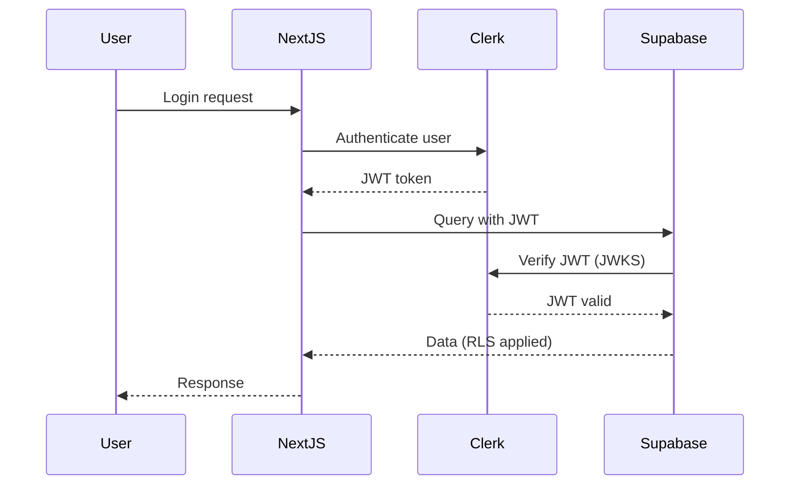
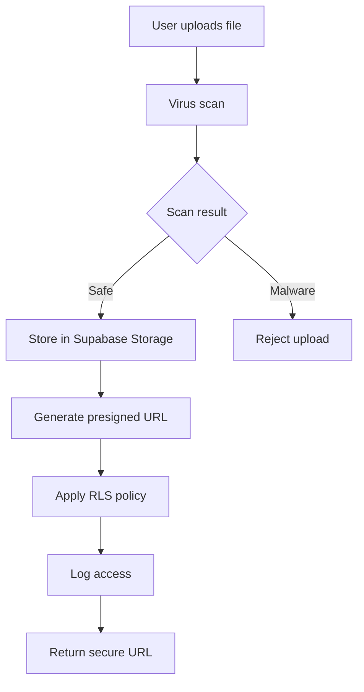

# Foldly - Technical Architecture Specification

## 🏗️ System Architecture Overview

**Foldly** is built as a modern, serverless **full-stack Next.js application** optimized for enterprise security and scalability using 2025's best practices with **Clerk + Supabase integration**.

> **Architecture Type**: **Full-stack Next.js application with hybrid authentication** - Clerk handles user management, Supabase provides data layer with Row Level Security

## 🎯 **Architecture Decision: Clerk + Supabase Hybrid Approach**

### **Why We Chose Clerk + Supabase Integration**

Based on industry security requirements and our [analysis of enterprise authentication patterns](https://clerk.com/docs/integrations/databases/supabase), we selected a **hybrid approach** that provides maximum security and control.

#### **Hybrid Authentication Architecture:**

```typescript
// Multi-layer security approach
Frontend (Next.js)
├── Clerk Provider (User management)
├── Supabase Client (Data access)
└── JWT Verification (Automatic)

Backend Services
├── Clerk Authentication (User management)
├── Supabase Database (Row Level Security)
├── Supabase Storage (File security)
└── Real-time (Socket.io + Supabase subscriptions)
```

#### **Security Benefits of This Approach:**

**1. Authentication Separation**

- **Clerk**: Handles user authentication, session management, RBAC
- **Supabase**: Handles data access control via Row Level Security
- **No single point of failure**: Auth and data systems are independent

**2. Enterprise-Grade Security**

- **JWT Verification**: Supabase automatically verifies Clerk JWTs via JWKS endpoint
- **Row Level Security**: Database-level protection for multi-tenant data
- **Audit Trails**: Complete logging across both systems
- **Zero Trust**: Every request verified at multiple layers

**3. Developer Control**

- **No vendor lock-in**: Open source Supabase can be self-hosted
- **API flexibility**: Direct database access with security guarantees
- **Real-time capabilities**: Built-in subscriptions and WebSocket support

### **Integration Pattern: JWT + RLS**

Based on [Clerk's official Supabase integration guide](https://dev.to/clerk/clerk-integrates-with-a-nextjs-application-using-supabase-1k5p):

```typescript
// Client-side data access with automatic auth
const { data, error } = await supabase
  .from('upload_links')
  .select('*')
  .order('created_at', { ascending: false })

// Supabase RLS policy automatically applies user context
CREATE POLICY "Users can view their own upload links"
  ON public.upload_links
  FOR SELECT
  USING (auth.jwt()->>'sub' = user_id);
```

### **Why This Approach is Enterprise-Ready**

**1. Security Best Practices**

- **Multi-layer authentication**: Defense in depth
- **Principle of least privilege**: RLS ensures users only access their data
- **Audit compliance**: Complete request tracking and logging

**2. Scalability Advantages**

- **Serverless architecture**: Auto-scaling database and auth
- **Global distribution**: Clerk + Supabase both offer global infrastructure
- **Real-time capabilities**: Live updates without custom WebSocket management

**3. Operational Benefits**

- **Unified monitoring**: Single dashboard for auth and data metrics
- **Cost optimization**: Pay-per-use model for both services
- **Developer productivity**: Type-safe APIs with automatic code generation

### **Enterprise Security Requirements Compliance**

Based on your employer's security requirements:

#### **Developer Access Control**

- **Company-owned accounts**: All Clerk and Supabase accounts owned by employer
- **Role-based access**: Developers have limited permissions, no billing access
- **Audit logging**: All developer actions logged and monitored
- **Secure credential sharing**: Environment variables only, no hard-coded secrets

#### **File Security**

- **Encrypted storage**: Files encrypted at rest in Supabase Storage
- **Secure access**: Presigned URLs with time-based expiration
- **Virus scanning**: Automatic malware detection on upload
- **Access logging**: Complete audit trail for all file operations

#### **Data Protection**

- **GDPR compliance**: Built-in data export and deletion capabilities
- **SOC 2 preparation**: Comprehensive security controls and monitoring
- **Row Level Security**: Database-level multi-tenancy protection
- **Encryption in transit**: TLS 1.3 for all communications

## 🔧 Technical Stack

### Full-Stack Application Components

#### Frontend (React/Next.js)

- **Framework**: Next.js 15+ (App Router) - handles both frontend and backend
- **Language**: TypeScript 5+
- **Styling**: TailwindCSS 4.0 + Shadcn/ui
- **State**: Zustand + React Query
- **Auth Client**: Clerk React components
- **Data Client**: Supabase JavaScript client
- **Real-time**: Socket.io client + Supabase subscriptions
- **Forms**: React Hook Form + Zod validation
- **Animations**: Framer Motion

#### Backend (Next.js API Routes + Supabase)

- **API**: tRPC (type-safe) + Next.js API Routes
- **Authentication**: Clerk (user management, RBAC)
- **Database**: Supabase PostgreSQL (with RLS)
- **Storage**: Supabase Storage (with CDN)
- **Real-time**: Supabase Realtime + Socket.io
- **ORM**: Drizzle ORM (type-safe database access)
- **Email**: Resend (transactional emails)
- **Payments**: Stripe (subscription management)

### Infrastructure

- **Hosting**: Vercel (Next.js optimized)
- **Backend Services**: Supabase (database, storage, real-time)
- **Authentication**: Clerk (user management, RBAC)
- **Monitoring**: Sentry + Supabase Dashboard
- **CDN**: Supabase CDN (global file delivery)
- **DNS**: Cloudflare (security + performance)

## 🔒 Enterprise Security Architecture

### Authentication Flow



### File Upload Security



### Data Protection Layers

1. **Network Layer**: TLS 1.3 encryption, CORS protection
2. **Authentication Layer**: Clerk JWT verification
3. **Authorization Layer**: Supabase Row Level Security
4. **Data Layer**: AES-256 encryption at rest
5. **Audit Layer**: Complete access logging

## 📊 Database Schema & Security

### Core Tables with RLS

```sql
-- Upload links (core feature)
CREATE TABLE upload_links (
  id UUID PRIMARY KEY DEFAULT gen_random_uuid(),
  user_id UUID NOT NULL, -- References Clerk user ID
  slug VARCHAR(100) UNIQUE NOT NULL,
  title VARCHAR(255) NOT NULL,
  description TEXT,
  max_files INTEGER DEFAULT 100,
  expires_at TIMESTAMP WITH TIME ZONE,
  created_at TIMESTAMP WITH TIME ZONE DEFAULT NOW(),
  updated_at TIMESTAMP WITH TIME ZONE DEFAULT NOW()
);

-- RLS Policy for upload links
CREATE POLICY "Users can only access their own upload links"
  ON upload_links
  FOR ALL
  USING (auth.jwt()->>'sub' = user_id::text);

-- File uploads
CREATE TABLE file_uploads (
  id UUID PRIMARY KEY DEFAULT gen_random_uuid(),
  upload_link_id UUID REFERENCES upload_links(id) ON DELETE CASCADE,
  uploader_name VARCHAR(255),
  uploader_email VARCHAR(255),
  file_name VARCHAR(255) NOT NULL,
  file_size BIGINT NOT NULL,
  file_type VARCHAR(100) NOT NULL,
  storage_path TEXT NOT NULL,
  uploaded_at TIMESTAMP WITH TIME ZONE DEFAULT NOW()
);

-- RLS Policy for file uploads
CREATE POLICY "Users can only access files from their upload links"
  ON file_uploads
  FOR ALL
  USING (
    upload_link_id IN (
      SELECT id FROM upload_links
      WHERE auth.jwt()->>'sub' = user_id::text
    )
  );
```

### Real-time Subscriptions

```typescript
// Real-time upload progress
const subscription = supabase
  .channel('file_uploads')
  .on(
    'postgres_changes',
    {
      event: 'INSERT',
      schema: 'public',
      table: 'file_uploads',
      filter: `upload_link_id=eq.${linkId}`,
    },
    payload => {
      // Update UI with new upload
      updateUploadProgress(payload.new);
    }
  )
  .subscribe();
```

## 🚀 Performance & Scalability

### Edge Computing Strategy

- **Vercel Edge Functions**: Authentication and API responses
- **Supabase Edge**: Database queries and real-time subscriptions
- **Global CDN**: File delivery via Supabase CDN
- **Caching**: Multi-layer caching (browser, CDN, database)

### Database Optimization

- **Connection pooling**: Supabase handles connection management
- **Query optimization**: Proper indexing and query patterns
- **Real-time efficiency**: Selective subscriptions to minimize bandwidth
- **Automatic scaling**: Serverless database scales with demand

### File Storage Optimization

- **CDN integration**: Automatic global distribution
- **Image optimization**: Automatic resizing and format conversion
- **Smart caching**: Intelligent cache invalidation
- **Bandwidth optimization**: Progressive loading and compression

## 🔍 Monitoring & Observability

### Application Monitoring

- **Error tracking**: Sentry integration for error reporting
- **Performance monitoring**: Real-time performance metrics
- **User analytics**: Posthog for user behavior tracking
- **Custom metrics**: Application-specific KPIs

### Security Monitoring

- **Authentication events**: Clerk dashboard and webhooks
- **Database access**: Supabase audit logs
- **File access**: Storage access logging
- **Anomaly detection**: Automated threat detection

### Business Intelligence

- **Usage analytics**: File upload patterns and user engagement
- **Performance metrics**: Upload speeds and success rates
- **Cost monitoring**: Resource usage and billing alerts
- **Growth tracking**: User acquisition and retention metrics

## 🔧 Development Environment

### Local Development Setup

```bash
# Environment variables
NEXT_PUBLIC_CLERK_PUBLISHABLE_KEY=pk_test_...
CLERK_SECRET_KEY=sk_test_...
NEXT_PUBLIC_SUPABASE_URL=https://your-project.supabase.co
NEXT_PUBLIC_SUPABASE_ANON_KEY=eyJ...
SUPABASE_SERVICE_ROLE_KEY=eyJ...
```

### Database Branching

- **Production**: Main Supabase project
- **Staging**: Supabase preview branch
- **Development**: Local Supabase or shared dev branch

### Testing Strategy

- **Unit tests**: Component and utility function testing
- **Integration tests**: API route and database operation testing
- **E2E tests**: Critical user flow testing with Playwright
- **Security tests**: Authentication and authorization testing

## 🎯 Deployment Architecture

### Production Environment

```
Vercel Production
├── Next.js Application (Global Edge)
├── API Routes (Serverless Functions)
└── Static Assets (Global CDN)

Supabase Production
├── PostgreSQL Database (Multi-region)
├── Storage Bucket (Global CDN)
├── Real-time Engine (WebSocket)
└── Edge Functions (Custom logic)

Clerk Production
├── Authentication Service (Global)
├── User Management Dashboard
└── Webhook Endpoints
```

### Deployment Pipeline

1. **Code commit**: GitHub repository
2. **Automated testing**: GitHub Actions
3. **Preview deployment**: Vercel preview
4. **Database migration**: Supabase CLI
5. **Production deployment**: Vercel production
6. **Health checks**: Automated monitoring

## 📋 Security Compliance Checklist

### Data Protection

- [x] **Encryption at rest**: AES-256 in Supabase
- [x] **Encryption in transit**: TLS 1.3 everywhere
- [x] **Access control**: Row Level Security policies
- [x] **Audit logging**: Complete access trails
- [x] **Data residency**: EU/US data center options

### Authentication Security

- [x] **Multi-factor authentication**: Clerk MFA support
- [x] **Session management**: Secure JWT handling
- [x] **Password policies**: Clerk security policies
- [x] **Social login**: OAuth integration
- [x] **Account recovery**: Secure recovery flows

### Application Security

- [x] **Input validation**: Zod schema validation
- [x] **CORS protection**: Proper origin configuration
- [x] **Rate limiting**: API request throttling
- [x] **SQL injection prevention**: Parameterized queries
- [x] **XSS protection**: Content Security Policy

This architecture provides enterprise-grade security while maintaining developer productivity and cost efficiency.

---

_This architecture specification serves as the technical blueprint for Foldly's modern, cost-optimized SaaS platform._
