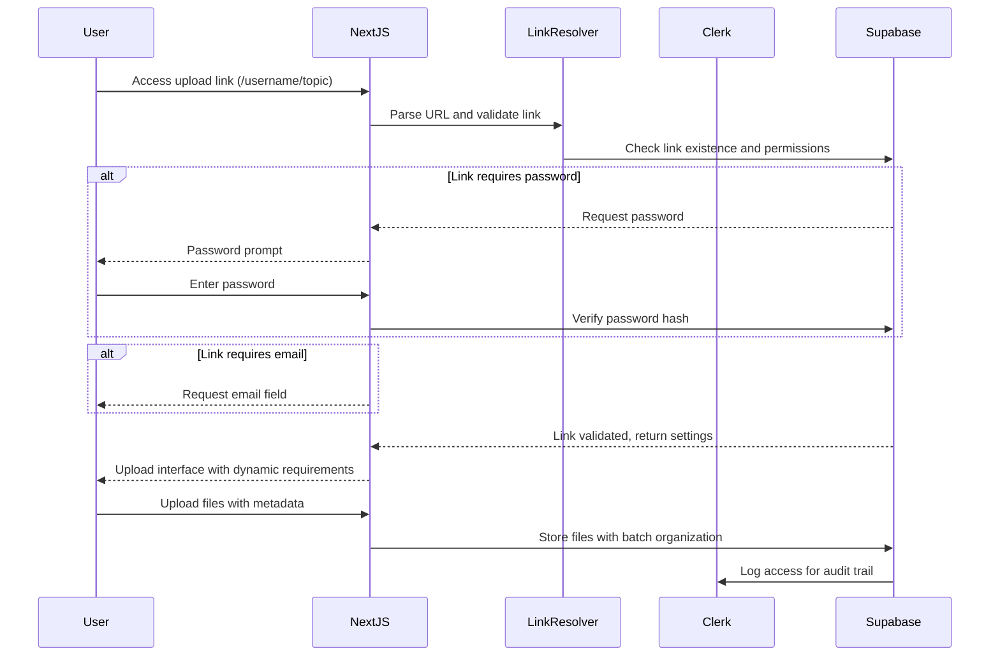
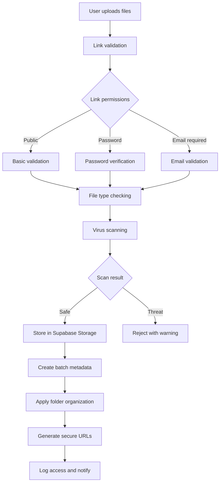

# Foldly - Advanced Multi-Link Technical Architecture Specification

## 🏗️ System Architecture Overview

**Foldly** is built as a modern, serverless **full-stack Next.js application** with **advanced multi-link capabilities**, **hierarchical organization**, and **granular security controls** using 2025's best practices with **Clerk + Supabase integration**.

> **Architecture Type**: **Full-stack Next.js application with hybrid authentication and multi-link routing** - Clerk handles user management, Supabase provides data layer with Row Level Security for complex permission systems

## 🎯 **Advanced Architecture: Multi-Link File Collection System**

### **Multi-Link Architecture Decision**

Based on the employer's requirements for **flexible link types**, **advanced organization**, and **granular security controls**, we've designed a sophisticated multi-link system.

#### **Link Type Architecture:**

```typescript
// Multi-link URL patterns and routing
Link Types:
├── Base Links: /[username]
│   ├── Purpose: General data dump area
│   ├── Security: User-configurable (email, password)
│   └── Organization: Auto-batch creation
├── Custom Topic Links: /[username]/[topic]
│   ├── Purpose: Project-specific uploads
│   ├── Security: Per-link permission controls
│   └── Organization: Auto-route to designated folders
└── Generated Links: Right-click folder creation
    ├── Purpose: Targeted folder uploads
    ├── Security: Inherits folder permissions
    └── Organization: Direct folder assignment
```

#### **Advanced Security & Organization Benefits:**

**1. Multi-Type Link System**

- **Base Links**: Flexible, general-purpose upload endpoints
- **Topic Links**: Project-specific with automatic organization
- **Generated Links**: Dynamic creation for any folder structure
- **Permission Inheritance**: Smart security propagation

**2. Hierarchical Organization**

- **Pre-Upload**: Uploaders can create folder structures
- **Batch Management**: Smart grouping with metadata
- **Post-Upload**: Full reorganization capabilities
- **Organization Workflow**: Recipients must drag received files into their personal workspace/repo area before organizing/reorganizing
- **Auto-Sorting**: Custom links route to designated locations

**3. Granular Security Controls**

- **Per-Link Settings**: Email requirements, password protection
- **Visibility Controls**: Public/private per link or folder
- **Access Logging**: Complete audit trail
- **Progressive Security**: Minimal friction by default, enhanced on demand

### **Integration Pattern: Multi-Link JWT + RLS**

Based on [Clerk's official Supabase integration guide](https://dev.to/clerk/clerk-integrates-with-a-nextjs-application-using-supabase-1k5p) with extensions for multi-link handling:

```typescript
// Multi-link data access with automatic auth and link resolution
const { data, error } = await supabase
  .from('upload_links')
  .select(`
    *,
    folders(*),
    file_uploads(
      *,
      upload_batches(*)
    )
  `)
  .eq('slug', username)
  .single()

// Supabase RLS policy automatically applies user context and link permissions
CREATE POLICY "Multi-link access control"
  ON public.upload_links
  FOR SELECT
  USING (
    CASE
      WHEN is_public = TRUE THEN TRUE
      WHEN auth.jwt()->>'sub' = user_id::text THEN TRUE
      ELSE FALSE
    END
  );
```

## 🔧 Advanced Technical Stack

### Enhanced Frontend Components

#### **Multi-Link Upload Interface**

- **Framework**: Next.js 15+ (App Router) with dynamic routing
- **Language**: TypeScript 5+ with strict mode
- **Styling**: TailwindCSS 4.0 + Shadcn/ui
- **State**: Zustand + React Query + Real-time subscriptions
- **Auth Client**: Clerk React components with multi-context support
- **Data Client**: Supabase JavaScript client with advanced queries
- **Real-time**: Socket.io client + Supabase subscriptions
- **Forms**: React Hook Form + Zod validation with dynamic schemas
- **Organization**: Drag-and-drop with react-beautiful-dnd
- **File Handling**: Advanced upload with progress tracking

#### **Advanced Backend Integration**

- **API**: tRPC (type-safe) + Next.js API Routes with multi-link routing
- **Authentication**: Clerk (user management, RBAC) with link-specific permissions
- **Database**: Supabase PostgreSQL with advanced RLS policies
- **Storage**: Supabase Storage with hierarchical organization
- **Real-time**: Supabase Realtime + Socket.io for live collaboration
- **ORM**: Drizzle ORM with complex relationship mapping
- **Security**: Advanced file validation and virus scanning
- **Email**: Resend with template system for notifications
- **Payments**: Stripe with usage-based billing for advanced features

## 🔒 Advanced Multi-Link Security Architecture

### **Link-Level Authentication Flow**



### **Advanced File Upload Security**



### **Hierarchical Security Model**

1. **Link Level**: Base security settings (public/private, password, email)
2. **Folder Level**: Inherited permissions with override capabilities
3. **File Level**: Individual file access controls and warnings
4. **Batch Level**: Group permissions and organization rules
5. **User Level**: Overall access patterns and audit logging

## 📊 Advanced Database Schema & Multi-Link Architecture

### **Core Multi-Link Tables**

```sql
-- Enhanced upload links with multi-type support
CREATE TABLE upload_links (
  id UUID PRIMARY KEY DEFAULT gen_random_uuid(),
  user_id UUID NOT NULL, -- References Clerk user ID
  slug VARCHAR(100) NOT NULL, -- username part (base for both link types)
  topic VARCHAR(100), -- NULL for base links, topic name for custom links
  title VARCHAR(255) NOT NULL,
  description TEXT,
  instructions TEXT, -- Custom instructions for uploaders

  -- Link type and behavior
  link_type VARCHAR(20) DEFAULT 'base' CHECK (link_type IN ('base', 'custom', 'generated')),
  auto_create_folders BOOLEAN DEFAULT TRUE,
  default_folder_id UUID REFERENCES folders(id),

  -- Security controls (recipient-managed)
  require_email BOOLEAN DEFAULT FALSE,
  require_password BOOLEAN DEFAULT FALSE,
  password_hash TEXT, -- bcrypt hash if password required
  is_public BOOLEAN DEFAULT TRUE, -- visibility control
  allow_folder_creation BOOLEAN DEFAULT TRUE, -- uploader can create folders

  -- File and upload limits
  max_files INTEGER DEFAULT 100,
  max_file_size BIGINT DEFAULT 104857600, -- 100MB default
  allowed_file_types TEXT[], -- MIME type restrictions
  expires_at TIMESTAMP WITH TIME ZONE,

  -- Usage tracking
  total_uploads INTEGER DEFAULT 0,
  total_files INTEGER DEFAULT 0,
  total_size BIGINT DEFAULT 0,
  last_upload_at TIMESTAMP WITH TIME ZONE,

  created_at TIMESTAMP WITH TIME ZONE DEFAULT NOW(),
  updated_at TIMESTAMP WITH TIME ZONE DEFAULT NOW(),

  -- Ensure unique combinations
  UNIQUE(user_id, slug, topic)
);

-- Create indexes for performance
CREATE INDEX idx_upload_links_slug ON upload_links(slug);
CREATE INDEX idx_upload_links_user_id ON upload_links(user_id);
CREATE INDEX idx_upload_links_public ON upload_links(is_public) WHERE is_public = TRUE;

-- Hierarchical folder system with advanced features
CREATE TABLE folders (
  id UUID PRIMARY KEY DEFAULT gen_random_uuid(),
  user_id UUID NOT NULL, -- References Clerk user ID
  parent_folder_id UUID REFERENCES folders(id) ON DELETE CASCADE,
  upload_link_id UUID REFERENCES upload_links(id) ON DELETE CASCADE,

  name VARCHAR(255) NOT NULL,
  description TEXT,
  color VARCHAR(7), -- Hex color for organization

  -- Auto-generated path for easy navigation
  path TEXT GENERATED ALWAYS AS (
    CASE
      WHEN parent_folder_id IS NULL THEN name
      ELSE (
        WITH RECURSIVE folder_path AS (
          SELECT name, parent_folder_id, 1 as level
          FROM folders
          WHERE id = folders.parent_folder_id
          UNION ALL
          SELECT f.name, f.parent_folder_id, fp.level + 1
          FROM folders f
          JOIN folder_path fp ON f.id = fp.parent_folder_id
        )
        SELECT string_agg(name, '/' ORDER BY level DESC) || '/' || folders.name
        FROM folder_path
      )
    END
  ) STORED,

  -- Folder settings
  auto_organize BOOLEAN DEFAULT TRUE,
  sort_order INTEGER DEFAULT 0,

  -- Security inheritance
  inherit_permissions BOOLEAN DEFAULT TRUE,
  custom_permissions JSONB,

  created_at TIMESTAMP WITH TIME ZONE DEFAULT NOW(),
  updated_at TIMESTAMP WITH TIME ZONE DEFAULT NOW()
);

-- Enhanced file uploads with comprehensive metadata
CREATE TABLE file_uploads (
  id UUID PRIMARY KEY DEFAULT gen_random_uuid(),
  upload_link_id UUID REFERENCES upload_links(id) ON DELETE CASCADE,
  folder_id UUID REFERENCES folders(id) ON DELETE SET NULL,
  batch_id UUID NOT NULL, -- Groups files uploaded together

  -- Uploader information (minimal required, more optional)
  uploader_name VARCHAR(255) NOT NULL, -- Mandatory field
  uploader_email VARCHAR(255), -- Optional, required if link demands it
  uploader_ip INET, -- For security logging
  user_agent TEXT, -- Browser/client information

  -- File metadata
  file_name VARCHAR(255) NOT NULL, -- Display name
  original_file_name VARCHAR(255) NOT NULL, -- Original upload name
  file_size BIGINT NOT NULL,
  file_type VARCHAR(100) NOT NULL,
  mime_type VARCHAR(100) NOT NULL,
  file_extension VARCHAR(10),

  -- Storage and processing
  storage_path TEXT NOT NULL,
  storage_bucket VARCHAR(100) DEFAULT 'uploads',
  thumbnail_path TEXT, -- For image/video previews

  -- Security and validation
  is_processed BOOLEAN DEFAULT FALSE,
  is_safe BOOLEAN DEFAULT TRUE, -- Virus scan result
  security_warnings JSONB, -- Warnings about file type, etc.
  checksum_md5 VARCHAR(32), -- File integrity
  checksum_sha256 VARCHAR(64),

  -- Organization metadata
  tags TEXT[], -- User-defined tags
  notes TEXT, -- Uploader notes
  priority INTEGER DEFAULT 0, -- Processing priority

  uploaded_at TIMESTAMP WITH TIME ZONE DEFAULT NOW(),
  processed_at TIMESTAMP WITH TIME ZONE
);

-- Advanced batch system for upload organization
CREATE TABLE upload_batches (
  id UUID PRIMARY KEY DEFAULT gen_random_uuid(),
  upload_link_id UUID REFERENCES upload_links(id) ON DELETE CASCADE,

  -- Batch metadata
  uploader_name VARCHAR(255) NOT NULL,
  uploader_email VARCHAR(255),
  batch_name VARCHAR(255), -- User-provided batch name
  notes TEXT, -- Additional context from uploader

  -- Batch statistics
  total_files INTEGER DEFAULT 0,
  processed_files INTEGER DEFAULT 0,
  failed_files INTEGER DEFAULT 0,
  total_size BIGINT DEFAULT 0,

  -- Processing status
  status VARCHAR(20) DEFAULT 'uploading' CHECK (status IN ('uploading', 'processing', 'completed', 'failed')),
  processing_started_at TIMESTAMP WITH TIME ZONE,
  processing_completed_at TIMESTAMP WITH TIME ZONE,

  -- Display format: [Uploader Name] (Batch Name) [Date]
  display_name TEXT GENERATED ALWAYS AS (
    uploader_name ||
    CASE
      WHEN batch_name IS NOT NULL THEN ' (' || batch_name || ')'
      ELSE ''
    END ||
    ' [' || to_char(created_at, 'YYYY-MM-DD') || ']'
  ) STORED,

  created_at TIMESTAMP WITH TIME ZONE DEFAULT NOW(),
  updated_at TIMESTAMP WITH TIME ZONE DEFAULT NOW()
);

-- Link access logging for security and analytics
CREATE TABLE link_access_logs (
  id UUID PRIMARY KEY DEFAULT gen_random_uuid(),
  upload_link_id UUID REFERENCES upload_links(id) ON DELETE CASCADE,

  -- Access information
  ip_address INET NOT NULL,
  user_agent TEXT,
  referer TEXT,

  -- Access type and result
  access_type VARCHAR(20) NOT NULL CHECK (access_type IN ('view', 'upload', 'download')),
  access_result VARCHAR(20) NOT NULL CHECK (access_result IN ('success', 'denied', 'error')),
  denial_reason VARCHAR(100), -- If access denied

  -- Context
  uploader_name VARCHAR(255), -- If provided during access
  uploader_email VARCHAR(255),
  files_uploaded INTEGER DEFAULT 0,
  bytes_uploaded BIGINT DEFAULT 0,

  created_at TIMESTAMP WITH TIME ZONE DEFAULT NOW()
);
```

### **Advanced Row Level Security Policies**

```sql
-- Multi-link upload access control
CREATE POLICY "Multi-link public access"
  ON upload_links
  FOR SELECT
  USING (
    is_public = TRUE AND
    (expires_at IS NULL OR expires_at > NOW())
  );

CREATE POLICY "Users manage their own upload links"
  ON upload_links
  FOR ALL
  USING (auth.jwt()->>'sub' = user_id::text);

-- Hierarchical folder access
CREATE POLICY "Folders follow link permissions"
  ON folders
  FOR SELECT
  USING (
    upload_link_id IN (
      SELECT id FROM upload_links
      WHERE is_public = TRUE OR auth.jwt()->>'sub' = user_id::text
    )
  );

CREATE POLICY "Users manage their own folders"
  ON folders
  FOR INSERT, UPDATE, DELETE
  USING (auth.jwt()->>'sub' = user_id::text);

-- File upload security with batch support
CREATE POLICY "Files accessible via link permissions"
  ON file_uploads
  FOR SELECT
  USING (
    upload_link_id IN (
      SELECT id FROM upload_links
      WHERE is_public = TRUE OR auth.jwt()->>'sub' = user_id::text
    )
  );

CREATE POLICY "Users manage files from their links"
  ON file_uploads
  FOR INSERT, UPDATE, DELETE
  USING (
    upload_link_id IN (
      SELECT id FROM upload_links
      WHERE auth.jwt()->>'sub' = user_id::text
    )
  );

-- Batch access control
CREATE POLICY "Batches follow link permissions"
  ON upload_batches
  FOR ALL
  USING (
    upload_link_id IN (
      SELECT id FROM upload_links
      WHERE is_public = TRUE OR auth.jwt()->>'sub' = user_id::text
    )
  );

-- Access logging (owner only)
CREATE POLICY "Users can view their own access logs"
  ON link_access_logs
  FOR SELECT
  USING (
    upload_link_id IN (
      SELECT id FROM upload_links
      WHERE auth.jwt()->>'sub' = user_id::text
    )
  );
```

### **Real-time Subscriptions for Multi-Link System**

```typescript
// Real-time upload progress with batch support
const subscription = supabase
  .channel(`upload_link_${linkId}`)
  .on(
    'postgres_changes',
    {
      event: 'INSERT',
      schema: 'public',
      table: 'file_uploads',
      filter: `upload_link_id=eq.${linkId}`,
    },
    payload => {
      // Update UI with new upload
      updateFileList(payload.new);
      updateBatchProgress(payload.new.batch_id);
    }
  )
  .on(
    'postgres_changes',
    {
      event: 'UPDATE',
      schema: 'public',
      table: 'upload_batches',
      filter: `upload_link_id=eq.${linkId}`,
    },
    payload => {
      // Update batch completion status
      updateBatchStatus(payload.new);
    }
  )
  .subscribe();

// Real-time folder organization
const folderSubscription = supabase
  .channel(`folders_${userId}`)
  .on(
    'postgres_changes',
    {
      event: '*',
      schema: 'public',
      table: 'folders',
      filter: `user_id=eq.${userId}`,
    },
    payload => {
      // Update folder tree in real-time
      updateFolderTree(payload);
    }
  )
  .subscribe();
```

## 🚀 Advanced Performance & Scalability

### **Multi-Link Edge Computing Strategy**

- **Dynamic Route Handling**: Vercel Edge Functions for link resolution
- **Caching Strategy**: Multi-layer caching for link metadata and permissions
- **Global Distribution**: Supabase Edge for database queries worldwide
- **File Delivery**: Supabase Storage CDN with regional optimization
- **Real-time Optimization**: Selective subscriptions to minimize bandwidth

### **Advanced Database Optimization**

- **Connection Pooling**: Supabase handles connection management with RLS
- **Query Optimization**: Proper indexing for multi-link queries
- **Hierarchical Queries**: Optimized recursive folder path generation
- **Batch Processing**: Efficient bulk operations for file uploads
- **Real-time Efficiency**: Targeted subscriptions per link and user

### **Multi-Link File Storage Optimization**

- **Hierarchical Storage**: Automatic organization by link and folder structure
- **CDN Integration**: Global distribution with Supabase Storage
- **Smart Caching**: Intelligent cache invalidation for security changes
- **Compression**: Automatic file optimization and progressive loading
- **Security Scanning**: Real-time virus detection with quarantine

## 🔍 Advanced Monitoring & Observability

### **Multi-Link Application Monitoring**

- **Error Tracking**: Sentry integration with link-specific error grouping
- **Performance Monitoring**: Real-time metrics per link type and usage
- **User Analytics**: Posthog for upload behavior and link effectiveness
- **Custom Metrics**: Link usage, batch completion rates, security incidents

### **Advanced Security Monitoring**

- **Access Monitoring**: Complete audit trail for all link access
- **Anomaly Detection**: Automated threat detection for unusual patterns
- **File Security**: Comprehensive virus scanning and type validation
- **Permission Monitoring**: Real-time alerts for security setting changes

### **Business Intelligence Dashboard**

- **Link Analytics**: Usage patterns for base vs custom links
- **Organization Metrics**: Folder creation and batch completion rates
- **Security Insights**: Access patterns and security feature adoption
- **Performance Tracking**: Upload speeds and success rates per link type

This advanced architecture provides enterprise-grade security while maintaining the zero-friction upload experience through sophisticated multi-link handling and intelligent organization systems.

---

_This architecture specification serves as the technical blueprint for Foldly's advanced multi-link file collection platform with comprehensive security and organization capabilities._
