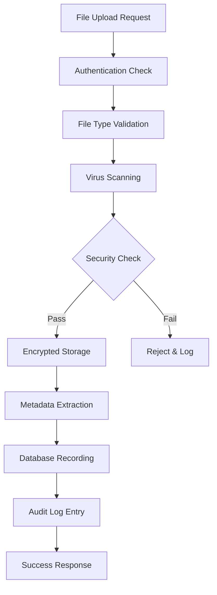

# Foldly - Enterprise Security Policy & Compliance Framework

> **Document Classification**: Internal Security Policy  
> **Last Updated**: January 2025  
> **Review Cycle**: Quarterly  
> **Owner**: Security & Engineering Team

---

## 🎯 **Executive Summary**

This security policy outlines Foldly's comprehensive approach to enterprise-grade security, data protection, and compliance. Our multi-layered security architecture ensures the highest level of protection for user data, uploaded files, and business operations while maintaining developer productivity and system scalability.

### **Security Pillars**

1. **Zero Trust Architecture**: Every request is verified at multiple layers
2. **Data Sovereignty**: Complete control over data access and storage
3. **Audit Transparency**: Full logging and monitoring of all operations
4. **Compliance Ready**: GDPR, SOC 2, and industry standards preparation
5. **Developer Security**: Secure development practices and access controls

---

## 🔒 **Authentication & Access Control**

### **Multi-Layer Authentication Architecture**

#### **Layer 1: User Authentication (Clerk)**

- **Multi-Factor Authentication (MFA)**: Required for all admin accounts
- **Social Login Security**: OAuth 2.0 with verified providers (Google, GitHub)
- **Session Management**: Secure JWT tokens with automatic refresh
- **Password Policies**: Enforced complexity and expiration requirements
- **Account Recovery**: Secure recovery flows with identity verification

#### **Layer 2: Database Access Control (Supabase RLS)**

- **Row Level Security**: Database-level protection for multi-tenant data
- **JWT Verification**: Automatic verification via JWKS endpoint
- **Policy-Based Access**: Granular permissions per table and operation
- **Audit Logging**: Complete database access tracking

#### **Layer 3: API Security**

- **Rate Limiting**: API request throttling per user/IP
- **CORS Protection**: Strict origin validation
- **Input Validation**: Zod schema validation for all inputs
- **SQL Injection Prevention**: Parameterized queries only

### **Role-Based Access Control (RBAC)**

```typescript
// User Role Hierarchy
enum UserRole {
  USER = 'user', // Standard file upload access
  PREMIUM = 'premium', // Enhanced features access
  ADMIN = 'admin', // Full platform administration
  SUPER_ADMIN = 'super_admin', // System-level access
}

// Permission Matrix
const permissions = {
  user: ['upload:create', 'files:view_own', 'links:create_basic'],
  premium: ['upload:unlimited', 'files:view_own', 'links:create_branded'],
  admin: ['users:manage', 'analytics:view', 'system:configure'],
  super_admin: ['*'], // All permissions
};
```

---

## 🛡️ **Data Protection & Encryption**

### **Encryption Standards**

#### **Data at Rest**

- **Algorithm**: AES-256 encryption for all stored data
- **Key Management**: Supabase managed encryption keys with rotation
- **Database**: PostgreSQL with column-level encryption for sensitive data
- **File Storage**: Encrypted storage with Supabase Storage

#### **Data in Transit**

- **Protocol**: TLS 1.3 for all communications
- **Certificate Management**: Automated SSL certificate renewal
- **API Security**: HTTPS-only with HSTS headers
- **WebSocket Security**: Secure WebSocket connections (WSS)

#### **Key Management**

- **Environment Variables**: Secure credential storage
- **API Keys**: Rotation policy every 90 days
- **Access Tokens**: Short-lived JWT tokens (15 minutes)
- **Refresh Tokens**: Secure storage with rotation

### **Data Classification & Handling**

```typescript
// Data Classification Levels
enum DataClassification {
  PUBLIC = 'public', // Marketing content
  INTERNAL = 'internal', // Business operations data
  CONFIDENTIAL = 'confidential', // User personal data
  RESTRICTED = 'restricted', // Payment & security data
}

// Handling Requirements by Classification
const handlingRequirements = {
  public: { encryption: false, logging: 'basic', retention: '1 year' },
  internal: { encryption: true, logging: 'standard', retention: '3 years' },
  confidential: { encryption: true, logging: 'enhanced', retention: '7 years' },
  restricted: { encryption: true, logging: 'complete', retention: '10 years' },
};
```

---

## 📁 **File Security Framework**

### **Upload Security Pipeline**



#### **File Upload Security Controls**

1. **Pre-Upload Validation**
   - File type whitelist enforcement
   - File size limits per user tier
   - Filename sanitization
   - MIME type verification

2. **Upload Process Security**
   - Virus and malware scanning
   - Content-based file type detection
   - Encrypted transmission (TLS 1.3)
   - Progress monitoring with real-time updates

3. **Post-Upload Processing**
   - Automatic thumbnail generation (images)
   - Metadata extraction and storage
   - File integrity verification
   - Backup creation for critical files

### **File Access Control**

#### **Secure File Delivery**

- **Presigned URLs**: Time-limited access with expiration
- **Access Logging**: Complete audit trail for file access
- **CDN Security**: Secure content delivery with edge caching
- **Download Throttling**: Rate limiting for file downloads

#### **File Retention Policy**

```typescript
// File Retention Rules
const retentionPolicies = {
  free_tier: { retention: '30 days', cleanup: 'automatic' },
  pro_tier: { retention: '1 year', cleanup: 'manual' },
  enterprise: { retention: '7 years', cleanup: 'policy_based' },
};

// Automatic Cleanup Process
const cleanupRules = {
  expired_links: 'delete_after_7_days',
  abandoned_uploads: 'delete_after_24_hours',
  deleted_accounts: 'purge_after_30_days',
};
```

---

## 👥 **Developer Access & Security Controls**

### **Development Environment Security**

#### **Company-Owned Account Structure**

```
Foldly Organization
├── Owner: [Company Email]
├── Billing Admin: [Company Email] - Clerk + Stripe Access
│   ├── Clerk Billing: Full subscription management
│   ├── Stripe Dashboard: Payment monitoring & disputes
│   └── Feature Management: Subscription tier controls
├── Developers: [Limited Access]
│   ├── Development: Read/Write
│   ├── Staging: Read/Write
│   └── Production: Read Only
└── Contractors: [Temporary Access]
    ├── Development: Read/Write
    └── Production: No Access
```

#### **Clerk Billing Security Architecture**

**Zero-Integration Security Benefits**:

- **Reduced Attack Surface**: No custom payment handling code reduces security vulnerabilities
- **PCI Compliance**: Stripe handles all payment data - Foldly never touches card information
- **Enterprise Authentication**: Clerk's enterprise-grade security combined with payment processing
- **Audit Trail**: Complete billing and subscription change logs through Clerk dashboard
- **Real-time Monitoring**: Automatic fraud detection and subscription abuse prevention

#### **Developer Access Controls**

**Account Management:**

- **Company Ownership**: All service accounts owned by company email
- **Role-Based Access**: Developers have limited permissions only
- **Time-Limited Access**: Contractor access expires automatically
- **2FA Required**: Multi-factor authentication for all developer accounts

**Code Security:**

- **Repository Access**: GitHub organization with branch protection
- **Code Reviews**: Required approvals before production deployment
- **Secret Management**: Environment variables only, no hardcoded secrets
- **Commit Signing**: GPG signed commits for audit trail

**Monitoring & Auditing:**

- **Activity Logging**: All developer actions logged and monitored
- **Session Recording**: Development session audit trails
- **Anomaly Detection**: Automated alerts for unusual activity
- **Regular Access Reviews**: Quarterly access permission audits

### **Secure Development Practices**

#### **Code Quality & Security**

```typescript
// Security Linting Rules
const securityRules = {
  'no-hardcoded-secrets': 'error',
  'no-unsafe-regex': 'error',
  'no-eval': 'error',
  'no-xss': 'error',
  'secure-random': 'warn',
  'https-only': 'error',
};

// Pre-commit Security Checks
const preCommitHooks = [
  'secret-detection',
  'dependency-vulnerability-scan',
  'code-quality-check',
  'test-coverage-minimum',
];
```

#### **Dependency Security**

- **Vulnerability Scanning**: Automated npm audit checks
- **Dependency Updates**: Regular security patch updates
- **License Compliance**: Open source license verification
- **Supply Chain Security**: Package integrity verification

---

## 🔍 **Monitoring & Incident Response**

### **Security Monitoring Stack**

#### **Real-Time Monitoring**

- **Application Monitoring**: Sentry for error tracking and performance
- **Authentication Events**: Clerk dashboard and webhook monitoring
- **Database Activity**: Supabase audit logs and query monitoring
- **File Access**: Complete audit trail for all file operations

#### **Threat Detection**

```typescript
// Automated Security Alerts
const alertRules = {
  failed_login_attempts: {
    threshold: 5,
    window: '5min',
    action: 'lock_account',
  },
  unusual_file_access: { threshold: 100, window: '1hour', action: 'flag_user' },
  bulk_data_download: {
    threshold: '1GB',
    window: '10min',
    action: 'rate_limit',
  },
  api_abuse: { threshold: 1000, window: '1min', action: 'ip_block' },
};

// Security Event Response
const responseActions = {
  account_compromise: ['lock_account', 'notify_admin', 'audit_access'],
  data_breach: [
    'isolate_affected_data',
    'notify_authorities',
    'user_notification',
  ],
  system_intrusion: [
    'emergency_lockdown',
    'forensic_analysis',
    'recovery_plan',
  ],
};
```

### **Incident Response Plan**

#### **Severity Levels & Response Times**

- **Critical (P0)**: System compromise - 15 min response
- **High (P1)**: Data exposure risk - 1 hour response
- **Medium (P2)**: Service disruption - 4 hour response
- **Low (P3)**: Minor security issue - 24 hour response

#### **Response Team Structure**

- **Incident Commander**: Overall response coordination
- **Security Lead**: Security analysis and containment
- **Engineering Lead**: System recovery and fixes
- **Communications Lead**: User and stakeholder communication

---

## 📋 **Compliance & Regulatory Framework**

### **GDPR Compliance**

#### **Data Protection Rights**

```typescript
// GDPR Data Subject Rights Implementation
const gdprRights = {
  right_to_access: {
    implementation: 'user_data_export_api',
    response_time: '30_days',
    format: 'machine_readable_json',
  },
  right_to_erasure: {
    implementation: 'account_deletion_cascade',
    response_time: '30_days',
    verification: 'identity_confirmation',
  },
  right_to_portability: {
    implementation: 'standardized_export',
    response_time: '30_days',
    format: 'industry_standard',
  },
};
```

#### **Privacy by Design**

- **Data Minimization**: Collect only necessary data
- **Purpose Limitation**: Use data only for stated purposes
- **Consent Management**: Clear, granular consent mechanisms
- **Breach Notification**: 72-hour notification protocol

### **SOC 2 Preparation**

#### **Security Control Framework**

- **Access Controls**: Identity and access management
- **System Operations**: Change management and monitoring
- **Risk Management**: Risk assessment and mitigation
- **Data Protection**: Encryption and secure handling

#### **Audit Readiness**

- **Documentation**: Comprehensive policy documentation
- **Evidence Collection**: Automated compliance reporting
- **Control Testing**: Regular security control validation
- **Continuous Monitoring**: Real-time compliance monitoring

---

## 💰 **Security Cost Analysis**

### **Security Investment Breakdown**

```
Service Security Costs (Monthly):
├── Authentication (Clerk Pro): $25
├── Database Security (Supabase Pro): $25
├── Monitoring (Sentry Pro): $26
├── Security Tools: $50
├── Compliance Auditing: $100
└── Security Training: $25
TOTAL: $251/month

ROI Analysis:
├── Data Breach Prevention: $2M+ potential savings
├── Compliance Fines Avoidance: $500K+ potential savings
├── Customer Trust Value: Immeasurable
└── Business Continuity: Operational resilience
```

### **Cost-Benefit Analysis**

- **Prevention Cost**: $251/month ($3,012/year)
- **Average Data Breach Cost**: $4.45M (IBM Security Report)
- **ROI**: 1,477x return on security investment
- **Compliance Benefits**: Enables enterprise sales and partnerships

---

## 🎯 **Implementation Roadmap**

### **Phase 1: Foundation Security (Week 1-2)**

- [x] Multi-layer authentication setup (Clerk + Supabase)
- [x] Row Level Security policy implementation
- [x] Basic monitoring and alerting
- [ ] File upload security pipeline
- [ ] Developer access controls

### **Phase 2: Advanced Security (Week 3-4)**

- [ ] Comprehensive audit logging
- [ ] Threat detection and response
- [ ] Compliance framework implementation
- [ ] Security testing and validation
- [ ] Documentation and training

### **Phase 3: Production Hardening (Week 5-6)**

- [ ] Penetration testing
- [ ] Security audit and review
- [ ] Incident response plan testing
- [ ] Performance optimization
- [ ] Continuous monitoring setup

---

## 📚 **Security Resources & Training**

### **Developer Security Training**

- **Secure Coding Practices**: OWASP Top 10 prevention
- **Authentication Security**: JWT handling and session management
- **Data Protection**: Encryption and privacy best practices
- **Incident Response**: Security event handling procedures

### **Security Documentation**

- **Security Handbook**: Comprehensive security guidelines
- **Incident Playbooks**: Step-by-step response procedures
- **Compliance Checklists**: Regulatory requirement tracking
- **Security Architecture**: System design and threat models

### **External Resources**

- **OWASP Security Guidelines**: Web application security standards
- **NIST Cybersecurity Framework**: Comprehensive security framework
- **ISO 27001 Standards**: Information security management
- **Industry Best Practices**: Continuous learning and improvement

---

## ✅ **Security Compliance Checklist**

### **Pre-Production Security Audit**

#### **Authentication & Access Control**

- [ ] Multi-factor authentication implemented
- [ ] Role-based access control configured
- [ ] Session management security validated
- [ ] Password policies enforced
- [ ] Account lockout mechanisms active

#### **Data Protection**

- [ ] Encryption at rest verified
- [ ] Encryption in transit confirmed
- [ ] Key management procedures documented
- [ ] Data classification implemented
- [ ] Backup encryption validated

#### **File Security**

- [ ] Upload security pipeline tested
- [ ] Virus scanning operational
- [ ] Access control mechanisms verified
- [ ] Audit logging functional
- [ ] Retention policies implemented

#### **Monitoring & Response**

- [ ] Security monitoring active
- [ ] Alerting rules configured
- [ ] Incident response plan documented
- [ ] Response team roles defined
- [ ] Communication procedures established

#### **Compliance**

- [ ] GDPR compliance measures implemented
- [ ] Data subject rights functionality tested
- [ ] Privacy policy published
- [ ] Terms of service updated
- [ ] Compliance reporting configured

---

## 📞 **Emergency Contacts & Procedures**

### **Security Emergency Contacts**

- **Security Lead**: [Contact Information]
- **Engineering Lead**: [Contact Information]
- **Legal Counsel**: [Contact Information]
- **External Security Consultant**: [Contact Information]

### **Emergency Response Procedures**

1. **Immediate Containment**: Isolate affected systems
2. **Assessment**: Evaluate scope and impact
3. **Notification**: Alert relevant stakeholders
4. **Investigation**: Conduct forensic analysis
5. **Recovery**: Restore secure operations
6. **Documentation**: Complete incident report

This security policy serves as the foundation for Foldly's enterprise-grade security posture, ensuring the protection of user data, business operations, and regulatory compliance while maintaining operational efficiency and developer productivity.
