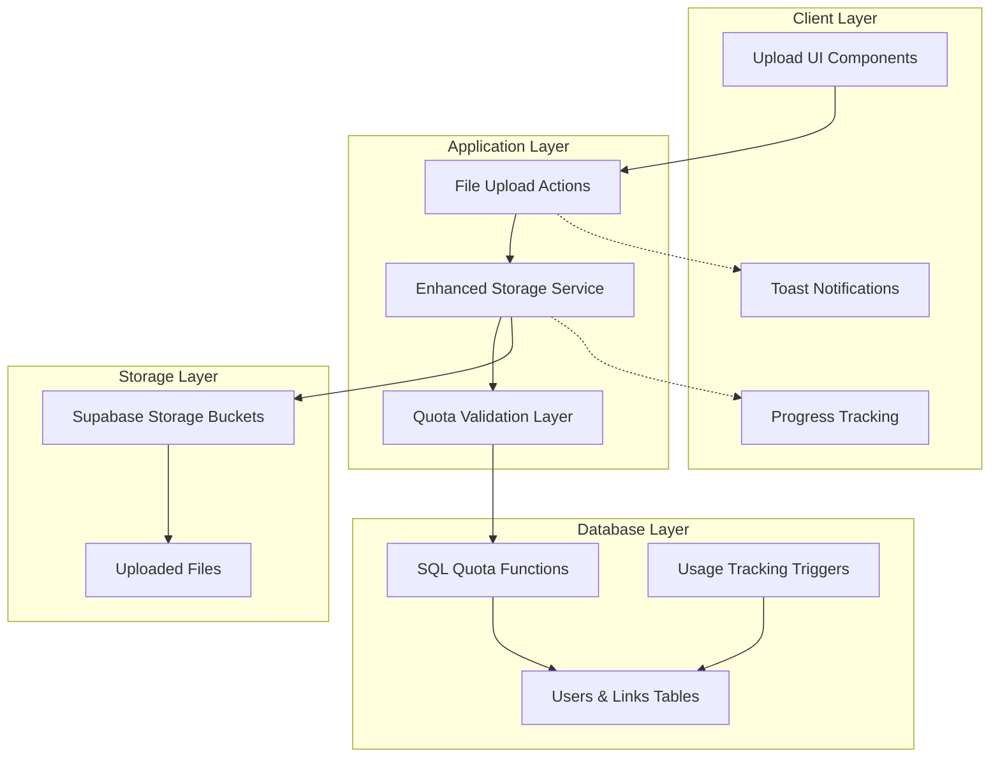
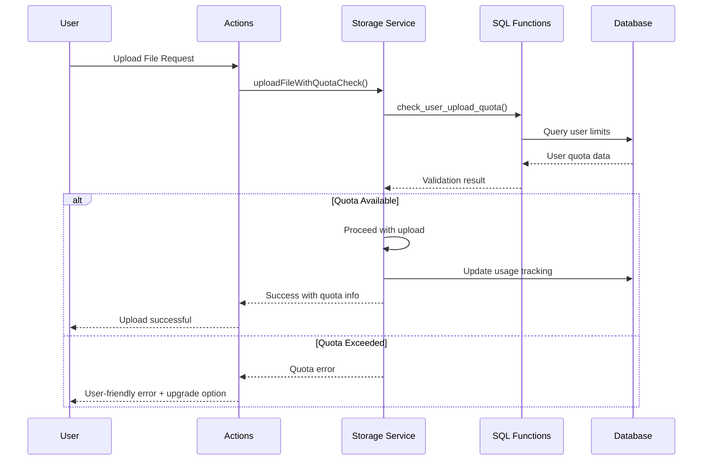
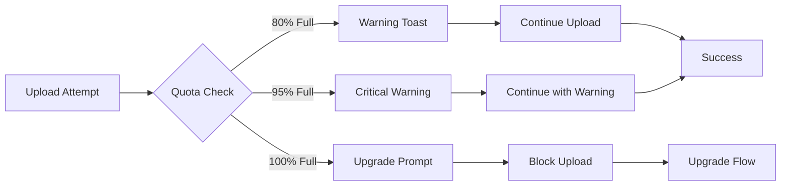
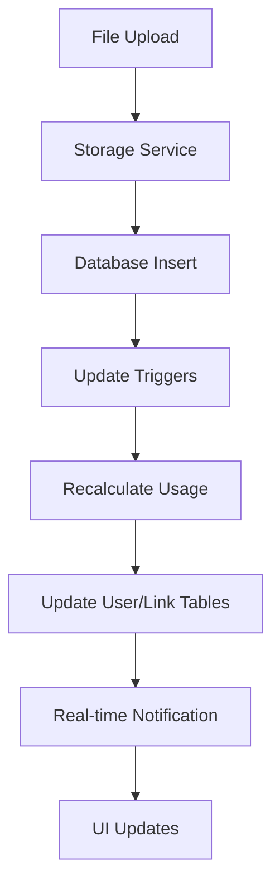

# Storage Quota System - Technical Architecture

> **System**: Multi-Tier Storage Quota Management  
> **Status**: ✅ **PRODUCTION READY**  
> **Architecture**: Database-First with Real-time Validation  
> **Last Updated**: January 2025

## 🏗️ System Architecture Overview



## 🎯 Core Components

### 1. Database Schema Architecture

#### Enhanced Users Table

```sql
users {
    id: TEXT PRIMARY KEY                    -- Clerk user ID
    subscription_tier: subscription_tier    -- free|pro|business
    storage_used: BIGINT DEFAULT 0          -- Bytes used
    storage_limit: BIGINT                   -- Tier-based limit
    files_uploaded: INTEGER DEFAULT 0       -- Total files count
    last_quota_warning_at: TIMESTAMP        -- Last warning sent
    created_at: TIMESTAMP
    updated_at: TIMESTAMP
}
```

#### Enhanced Links Table

```sql
links {
    id: UUID PRIMARY KEY
    user_id: TEXT REFERENCES users(id)
    storage_used: BIGINT DEFAULT 0          -- Per-link usage
    storage_limit: BIGINT DEFAULT 524288000 -- 500MB default
    total_files: INTEGER DEFAULT 0          -- Files in this link
    max_files: INTEGER DEFAULT 100          -- File count limit
    max_file_size: BIGINT DEFAULT 104857600 -- 100MB default
}
```

### 2. Subscription Tier Configuration

| Tier         | Storage | File Size | Links | Cost      |
| ------------ | ------- | --------- | ----- | --------- |
| **Free**     | 1GB     | 10MB      | 1     | $0/month  |
| **Pro**      | 100GB   | 100MB     | 5     | $9/month  |
| **Business** | 500GB   | 500MB     | 25    | $29/month |

### 3. Quota Validation Flow



## 🔧 Technical Implementation

### SQL Function Architecture

#### User Quota Validation Function

```sql
check_user_upload_quota(user_id, file_size) RETURNS JSON
```

- **Input**: User ID and file size
- **Processing**:
  - Retrieves subscription tier limits
  - Calculates available space
  - Validates file size limits
- **Output**: JSON with validation result and quota info

#### Link Quota Validation Function

```sql
check_link_upload_quota(link_id, file_size) RETURNS JSON
```

- **Input**: Link ID and file size
- **Processing**:
  - Checks link-specific limits
  - Validates file count limits
  - Calculates per-link usage
- **Output**: JSON with link quota status

### Storage Service Enhancement

#### Quota-Aware Upload Method

```typescript
uploadFileWithQuotaCheck(
  file: File,
  path: string,
  userId: string,
  linkId?: string,
  context: StorageContext
): Promise<DatabaseResult<UploadResult & { quotaInfo: any }>>
```

**Flow**:

1. **Pre-validation**: Check user and link quotas
2. **Upload**: Proceed if quotas allow
3. **Post-processing**: Update usage tracking
4. **Response**: Include quota information

### Error Handling Architecture

#### Quota Error Types

```typescript
type QuotaErrorType =
  | 'quota_exceeded' // User storage limit reached
  | 'file_too_large' // File exceeds tier limit
  | 'link_quota_exceeded' // Link storage full
  | 'file_count_exceeded' // Link file count limit
  | 'user_not_found' // Invalid user
  | 'link_not_found'; // Invalid link
```

#### Error Response Format

```typescript
interface QuotaError {
  allowed: false;
  error: QuotaErrorType;
  message: string;
  details: {
    current_usage?: number;
    limit?: number;
    required_space?: number;
    subscription_tier?: string;
  };
}
```

## 🎨 User Experience Architecture

### Progressive Disclosure Pattern



### Toast Notification System

#### Usage Warnings

- **80% Full**: Gentle reminder about approaching limit
- **95% Full**: Strong warning about nearly full storage
- **100% Full**: Block upload with upgrade prompt

#### Error Messages

- **Contextual**: Specific to the error type
- **Actionable**: Clear next steps provided
- **Helpful**: Suggest solutions or alternatives

## 📊 Performance Considerations

### Database Performance

#### Optimized Indexes

```sql
-- Users table performance indexes
CREATE INDEX users_subscription_tier_idx ON users(subscription_tier);
CREATE INDEX users_storage_usage_idx ON users(storage_used);

-- Links table performance indexes
CREATE INDEX links_user_storage_idx ON links(user_id, storage_used);
CREATE INDEX links_total_files_idx ON links(total_files);
```

#### Query Optimization

- **Batch Operations**: Group multiple quota checks
- **Caching Strategy**: Cache quota limits by subscription tier
- **Connection Pooling**: Efficient database connections

### Storage Performance

#### Upload Optimization

- **Parallel Validation**: User and link quotas checked concurrently
- **Early Termination**: Stop upload if quota exceeded
- **Streaming Uploads**: Handle large files efficiently

#### Usage Tracking

- **Atomic Updates**: Ensure consistency in usage calculations
- **Trigger Optimization**: Efficient storage tracking triggers
- **Batch Recalculation**: Periodic usage verification

## 🔒 Security Architecture

### Access Control

#### Row Level Security (RLS)

```sql
-- Users can only access their own quota information
CREATE POLICY user_quota_access ON users
FOR SELECT USING (auth.uid() = id);

-- Users can only check quotas for their own links
CREATE POLICY link_quota_access ON links
FOR SELECT USING (auth.uid() = user_id);
```

#### Function Security

```sql
-- Quota functions use SECURITY DEFINER
-- Execute with elevated privileges for accurate quota checks
CREATE FUNCTION check_user_upload_quota(...)
...
SECURITY DEFINER;
```

### Data Validation

#### Input Sanitization

- **File Size Validation**: Prevent negative or excessive values
- **User ID Validation**: Ensure valid Clerk user IDs
- **Link ID Validation**: Verify UUID format and existence

#### Business Logic Validation

- **Subscription Tier Consistency**: Ensure limits match tiers
- **Usage Calculation Accuracy**: Verify stored vs calculated usage
- **Quota Limit Enforcement**: Strict adherence to tier limits

## 🔄 Real-time Updates Architecture

### Usage Tracking System



### Database Triggers

#### User Storage Tracking

```sql
-- Automatically update user storage when files change
CREATE TRIGGER update_user_storage
AFTER INSERT OR UPDATE OR DELETE ON files
FOR EACH ROW EXECUTE FUNCTION update_user_storage_usage();
```

#### Link Storage Tracking

```sql
-- Automatically update link storage when files change
CREATE TRIGGER update_link_storage
AFTER INSERT OR UPDATE OR DELETE ON files
FOR EACH ROW EXECUTE FUNCTION update_link_storage_usage();
```

## 📈 Monitoring and Analytics

### Usage Metrics Collection

#### Key Performance Indicators

- **Quota Validation Speed**: < 100ms per check
- **Upload Success Rate**: > 99% for valid uploads
- **Storage Accuracy**: 100% usage tracking accuracy
- **Error Rate**: < 0.1% false quota rejections

#### Business Metrics

- **Conversion Tracking**: Free to paid upgrades from quota limits
- **Usage Patterns**: Storage consumption by subscription tier
- **Feature Adoption**: Quota dashboard usage metrics
- **Support Impact**: Reduction in quota-related tickets

### Alerting System

#### Automated Alerts

- **High Usage**: Users approaching 90% quota
- **System Health**: Quota validation performance monitoring
- **Data Integrity**: Usage calculation discrepancies
- **Upgrade Opportunities**: Users hitting free tier limits

## 🚀 Deployment Architecture

### Database Migrations

#### Migration Strategy

1. **Schema Updates**: Add quota fields to existing tables
2. **Function Creation**: Deploy SQL quota validation functions
3. **Index Creation**: Add performance indexes
4. **Trigger Setup**: Enable automatic usage tracking
5. **Data Migration**: Calculate initial usage for existing users

#### Rollback Plan

- **Function Versions**: Keep previous versions for rollback
- **Schema Rollback**: Remove new columns if needed
- **Data Consistency**: Ensure data integrity during rollback

### Application Deployment

#### Feature Flags

- **Quota Validation**: Enable/disable quota checking
- **Error Handling**: Toggle between strict/permissive modes
- **Usage Dashboard**: Control UI feature availability
- **Upgrade Prompts**: Enable/disable subscription prompts

#### Monitoring

- **Application Performance**: Track quota validation impact
- **Error Rates**: Monitor quota-related errors
- **User Experience**: Track upload success rates
- **Business Metrics**: Monitor conversion rates

## 🛠️ Development Guidelines

### Code Organization

```
src/
├── lib/
│   ├── services/shared/
│   │   └── storage-service.ts         # Enhanced with quota methods
│   └── supabase/schemas/
│       ├── users.ts                   # Enhanced with storage fields
│       ├── links.ts                   # Enhanced with quota fields
│       └── enums.ts                   # Updated subscription tiers
├── features/workspace/lib/actions/
│   └── file-actions.ts                # Quota-aware upload actions
└── drizzle/
    └── 0005_quota_system.sql          # Migration with SQL functions
```

### Testing Strategy

#### Unit Tests

- **SQL Functions**: Test quota validation logic
- **Storage Service**: Test quota-aware upload methods
- **Error Handling**: Test all quota error scenarios

#### Integration Tests

- **End-to-End**: Complete upload flow with quota validation
- **Performance**: Quota validation under load
- **Edge Cases**: Boundary conditions and error states

#### User Acceptance Tests

- **Upgrade Flows**: Test subscription upgrade scenarios
- **Error Recovery**: User experience during quota errors
- **Dashboard Functionality**: Usage visualization and warnings

---

**Result**: 🏗️ **Comprehensive technical architecture for production-ready storage quota management system with real-time validation, performance optimization, and scalable design patterns.**
