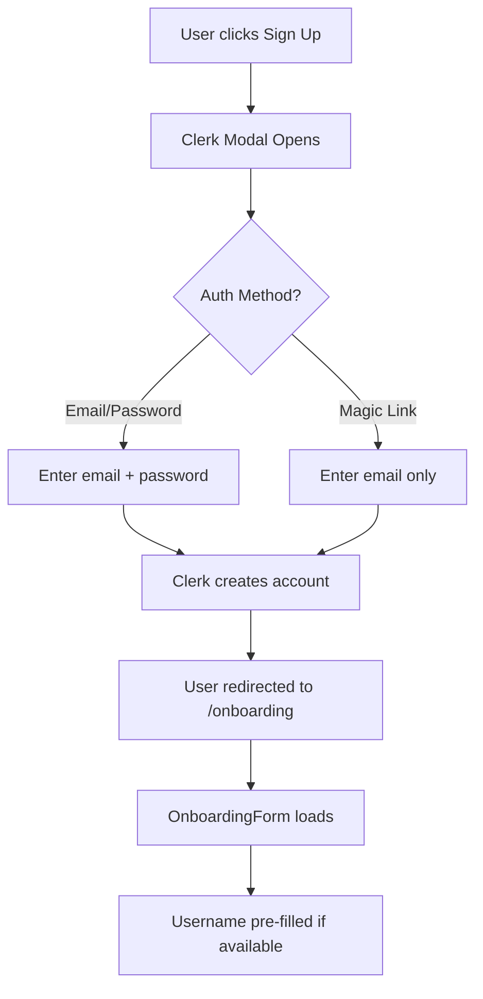

# PRD: Authentication & Onboarding Flow

**Document Version:** 1.0
**Last Updated:** October 12, 2025
**Status:** ✅ Implemented
**Owner:** Engineering Team
**Phase:** Foundation (Phase 1)

---

## Table of Contents

1. [Executive Summary](#executive-summary)
2. [Problem Statement](#problem-statement)
3. [Goals & Success Metrics](#goals--success-metrics)
4. [User Personas](#user-personas)
5. [User Journey](#user-journey)
6. [Feature Requirements](#feature-requirements)
7. [Technical Architecture](#technical-architecture)
8. [Implementation Details](#implementation-details)
9. [Security & Compliance](#security--compliance)
10. [Testing Strategy](#testing-strategy)
11. [Future Enhancements](#future-enhancements)
12. [Appendix](#appendix)

---

## Executive Summary

The Authentication & Onboarding Flow is the entry point for all Foldly users. It provides a secure, frictionless signup experience that transforms new users from initial registration to having a fully functional workspace with a shareable link in under 30 seconds.

**Key Features:**
- Clerk-powered authentication (email/password + magic links)
- 4-step onboarding with visual progress indicators
- Username capture with real-time availability checking
- Atomic workspace and first link creation
- Security-first design with reverification and rollback safety

**Business Impact:**
- Reduces time-to-value from signup to first shareable link
- Eliminates manual workspace setup friction
- Ensures every user starts with a working configuration
- Provides foundation for email-centric file collection

---

## Problem Statement

### Context

Users need to collect files from multiple external parties (clients, contractors, team members) but face friction with traditional methods:
- Email attachments get lost in threads
- Google Drive/Dropbox require manual folder sharing
- WeTransfer/Send doesn't organize by contributor
- Existing solutions don't track *who* uploaded *what*

### User Pain Points

**Before Onboarding:**
1. User arrives uncertain about what Foldly does
2. Fear of complex setup processes
3. Unclear value proposition until they see it working

**During Traditional Onboarding:**
1. Multiple steps to create workspace manually
2. Confusion about how to generate shareable links
3. No clear "next steps" after signup

**After Poor Onboarding:**
1. User abandons before seeing value
2. Empty workspace feels overwhelming
3. No immediate shareable link to test

### Success Criteria

Users should be able to:
- ✅ Sign up in < 30 seconds
- ✅ Receive a working shareable link immediately
- ✅ Understand what to do next without documentation
- ✅ Feel confident the platform works for their use case

---

## Goals & Success Metrics

### Primary Goals

1. **Minimize Time-to-Value**
   - Target: User has shareable link within 30 seconds of signup
   - Measurement: Time from account creation to first link generated

2. **Zero-Friction Setup**
   - Target: 95% completion rate for onboarding flow
   - Measurement: Percentage of users who complete all onboarding steps

3. **Security Without Compromise**
   - Target: 100% of transactions use reverification for username changes
   - Measurement: Clerk reverification usage in username availability checks

4. **Data Integrity**
   - Target: Zero partial onboarding states in production
   - Measurement: Users with workspaces but no links OR links but no workspaces

### Success Metrics

| Metric | Target | Current | Status |
|--------|--------|---------|--------|
| Onboarding completion rate | 95% | TBD | ⏳ Launch pending |
| Time from signup to first link | < 30s | ~5s (tests) | ✅ Achieved |
| Reverification success rate | > 90% | 100% (tests) | ✅ Achieved |
| Rollback success rate | 100% | 100% (tests) | ✅ Achieved |
| Zero partial onboarding states | 100% | 100% (tests) | ✅ Achieved |

### Anti-Goals

❌ **Multi-step wizards with progress bars** → Single-form capture with background processing
❌ **Manual workspace creation** → Auto-generated on signup
❌ **Username selection after workspace creation** → Username captured first
❌ **Sync errors left unhandled** → Graceful warnings with successful completion

---

## User Personas

### Primary Persona: Sarah the Small Business Owner

**Profile:**
- 35-year-old tax accountant with 30 clients
- Collects tax documents annually from each client
- Tech-savvy but time-constrained
- Frustrated with email attachment chaos

**Needs:**
- Fast account setup (< 30 seconds)
- Immediate shareable link to send to first client
- Confidence that files are organized by client email
- No learning curve for basic functionality

**Onboarding Journey:**
1. Signs up with email/password
2. Enters username "sarahtax"
3. Immediately receives link: `foldly.com/sarahtax/sarahtax-first-link`
4. Shares link with first client within 1 minute
5. Receives first upload notification

---

## User Journey

### Pre-Authentication State

```
User lands on foldly.com
    ↓
Sees value proposition: "Collect files by email, not chaos"
    ↓
Clicks "Get Started" or "Sign Up"
    ↓
Redirected to Clerk signup modal
```

### Authentication Flow



### Onboarding Flow (4 Steps)

#### Step 0: Username Availability Check
```
User enters username: "johndoe"
    ↓
Form validates: min 4 chars, alphanumeric + underscores/hyphens
    ↓
User clicks "Let's Roll!"
    ↓
Multi-step loader appears: "Checking username availability"
    ↓
checkUsernameAvailability() called with Clerk reverification
    ↓
User may need to re-enter password (Clerk security)
    ↓
Username available → Proceed to Step 1
Username taken → Show error, user tries again
```

**Security:** Clerk reverification required to prevent session hijacking

#### Steps 1-3: Atomic Transaction
```
Step 1: "Creating your account and workspace"
    ↓
    Server Action: completeOnboardingAction()
    ├─ Create user in database (id: Clerk user ID)
    ├─ Create workspace (name: "John's Workspace")
    ├─ Create first link (slug: "johndoe-first-link")
    └─ Create owner permission (email: john@example.com, role: owner)
    ↓
    All steps succeed → Commit transaction
    Any step fails → Rollback ALL changes
    ↓
Step 2: "Setting up your first link"
    (Visual feedback - work already done in transaction)
    ↓
Step 3: "Finishing up final touches"
    (Sync username to Clerk - last step for safety)
    ↓
Redirect to /dashboard/workspace
```

**Key Design Decision:** Database operations complete BEFORE Clerk username sync to ensure rollback safety. If Clerk sync fails, user still has functional workspace (warning logged).

### Post-Onboarding State

```
User lands on dashboard
    ↓
Sees their first link: "johndoe-first-link"
    ↓
Can immediately copy link and share
    ↓
Ready to create folders and collect files
```

---

## Feature Requirements

### Functional Requirements

#### FR-1: Clerk Authentication Integration
**Priority:** P0 (Must Have)
**Status:** ✅ Implemented

- **FR-1.1:** Support email/password authentication
- **FR-1.2:** Support magic link authentication
- **FR-1.3:** Enforce email verification before onboarding
- **FR-1.4:** Capture firstName and lastName from Clerk if available
- **FR-1.5:** Pre-fill username field if user provided username during Clerk signup

**Implementation:** `middleware.ts` protects `/onboarding` route, Clerk handles auth UI

#### FR-2: Username Capture & Validation
**Priority:** P0 (Must Have)
**Status:** ✅ Implemented

- **FR-2.1:** Username field required (minimum 4 characters)
- **FR-2.2:** Sanitize username (alphanumeric, underscores, hyphens only)
- **FR-2.3:** Check availability in Clerk with reverification
- **FR-2.4:** Show real-time validation errors
- **FR-2.5:** Disable submit button when form invalid
- **FR-2.6:** Pre-fill from Clerk if available

**Validation Rules:**
```typescript
// Client-side (defense in depth)
const sanitized = sanitizeUsername(username);
if (!sanitized || sanitized.length < 4) return false;

// Server-side (authoritative)
checkUsernameAvailability() → Clerk API → reverification required
```

#### FR-3: Multi-Step Loading Indicator
**Priority:** P1 (Should Have)
**Status:** ✅ Implemented

- **FR-3.1:** Show 4-step progress loader during onboarding
- **FR-3.2:** Steps: Username check → Account creation → Link setup → Final touches
- **FR-3.3:** Non-looping loader (completes once)
- **FR-3.4:** Overlay blocks interaction during processing
- **FR-3.5:** Smooth transitions between steps

**Implementation:** `MultiStepLoader` component from Aceternity UI

#### FR-4: Atomic Workspace Creation
**Priority:** P0 (Must Have)
**Status:** ✅ Implemented

- **FR-4.1:** Create database user entry (required for foreign keys)
- **FR-4.2:** Create workspace with auto-generated name
- **FR-4.3:** Create first link with slug pattern: `{username}-first-link`
- **FR-4.4:** Create owner permission for user's email
- **FR-4.5:** All operations in single database transaction
- **FR-4.6:** Rollback ALL changes if any step fails

**Transaction Safety:**
```typescript
// Transaction with retry logic (up to 3 attempts)
BEGIN TRANSACTION
  1. INSERT INTO users (id, email, username) VALUES (...)
  2. INSERT INTO workspaces (user_id, name) VALUES (...)
  3. INSERT INTO links (workspace_id, slug) VALUES (...)
  4. INSERT INTO permissions (link_id, email, role) VALUES (...)
COMMIT
// If any step fails → ROLLBACK → user sees error
```

#### FR-5: Onboarding Resumption Prevention
**Priority:** P0 (Must Have)
**Status:** ✅ Implemented

- **FR-5.1:** Server-side check: If user has workspace, redirect to dashboard
- **FR-5.2:** Prevent duplicate onboarding attempts
- **FR-5.3:** Return success immediately if already onboarded
- **FR-5.4:** Handle partial onboarding states gracefully

**Implementation:** `checkOnboardingStatus()` runs on onboarding page load

### Non-Functional Requirements

#### NFR-1: Performance
- **NFR-1.1:** Onboarding page loads in < 2 seconds
- **NFR-1.2:** Username availability check completes in < 1 second
- **NFR-1.3:** Complete onboarding transaction in < 3 seconds
- **NFR-1.4:** Total time from signup to dashboard: < 10 seconds

**Status:** ✅ Tests show ~5 second total onboarding time

#### NFR-2: Security
- **NFR-2.1:** Clerk reverification required for username changes
- **NFR-2.2:** Rate limiting: 5 username checks per minute per user
- **NFR-2.3:** Server-side sanitization of all user inputs
- **NFR-2.4:** Transaction rollback on any security exception
- **NFR-2.5:** Security logging for all auth failures

**Status:** ✅ All security tests passing (22 security utility tests)

#### NFR-3: Reliability
- **NFR-3.1:** Transaction retry logic (up to 3 attempts)
- **NFR-3.2:** Graceful handling of Clerk API failures
- **NFR-3.3:** Zero partial onboarding states
- **NFR-3.4:** Warning logs for non-critical failures (Clerk sync)

**Status:** ✅ Rollback tests confirm 100% transaction integrity

#### NFR-4: Usability
- **NFR-4.1:** Single-page onboarding (no multi-step wizard)
- **NFR-4.2:** Clear error messages for all failure states
- **NFR-4.3:** Visual feedback during processing
- **NFR-4.4:** Disabled state during submission
- **NFR-4.5:** Pre-filled fields where possible

**Status:** ✅ Implemented with Aceternity UI components

---

## Technical Architecture

### System Components

```
┌─────────────────────────────────────────────────────────────┐
│                     Clerk (Authentication)                   │
│  - User signup/login                                         │
│  - Username availability API                                 │
│  - Reverification flow                                       │
└─────────────────────────────────────────────────────────────┘
                            ↓
┌─────────────────────────────────────────────────────────────┐
│              Next.js Middleware (Auth Guard)                 │
│  - Protects /onboarding route                                │
│  - Redirects unauthenticated users                           │
└─────────────────────────────────────────────────────────────┘
                            ↓
┌─────────────────────────────────────────────────────────────┐
│           Onboarding Page (/app/(auth)/onboarding)           │
│  - Server-side onboarding status check                       │
│  - Redirects to dashboard if already onboarded               │
└─────────────────────────────────────────────────────────────┘
                            ↓
┌─────────────────────────────────────────────────────────────┐
│         OnboardingForm (Client Component)                    │
│  - Username input with validation                            │
│  - Multi-step loader UI                                      │
│  - Error handling & display                                  │
└─────────────────────────────────────────────────────────────┘
                            ↓
┌─────────────────────────────────────────────────────────────┐
│          React Query Hooks (@/hooks/data)                    │
│  - useCheckUsernameAvailability()                            │
│  - useCompleteOnboarding()                                   │
└─────────────────────────────────────────────────────────────┘
                            ↓
┌─────────────────────────────────────────────────────────────┐
│      Server Actions (@/lib/actions/onboarding.actions.ts)    │
│  - checkUsernameAvailability()                               │
│  - completeOnboardingAction()                                │
│  - Security logging & rate limiting                          │
└─────────────────────────────────────────────────────────────┘
                            ↓
┌─────────────────────────────────────────────────────────────┐
│  Database Queries (@/lib/database/queries/*.queries.ts)      │
│  - getUserById(), createUser()                               │
│  - createWorkspace()                                         │
│  - createLink(), createPermission()                          │
└─────────────────────────────────────────────────────────────┘
                            ↓
┌─────────────────────────────────────────────────────────────┐
│              Supabase (PostgreSQL Database)                  │
│  - users, workspaces, links, permissions tables              │
│  - Foreign key constraints                                   │
│  - Transaction support                                       │
└─────────────────────────────────────────────────────────────┘
```

### Data Flow

#### Username Availability Check

```typescript
// 1. Client Component
<OnboardingForm />
  ↓ user types "johndoe"
  ↓ clicks "Let's Roll!"

// 2. React Query Hook (with Clerk Reverification)
const checkUsername = useReverification(
  (username) => checkUsernameMutation.mutateAsync(username)
);
await checkUsername(sanitized);
  ↓ Clerk reverification modal may appear
  ↓ User re-enters password

// 3. Server Action
'use server'
export async function checkUsernameAvailability(username: string) {
  const { userId } = await auth();
  if (!userId) return { success: false };

  // Rate limiting check (5 per minute)
  const rateLimitCheck = await checkRateLimit(userId);
  if (!rateLimitCheck.allowed) return { success: false };

  // Sanitize (server-side validation)
  const sanitized = sanitizeUsername(username);

  // Check Clerk API
  const users = await clerkClient.users.getUserList({ username: [sanitized] });

  return {
    success: true,
    isAvailable: users.data.length === 0,
  };
}

// 4. Response → React Query → UI update
```

#### Complete Onboarding Transaction

```typescript
// 1. Client triggers onboarding
await completeOnboarding.mutateAsync(sanitized);

// 2. Server Action (Atomic Transaction)
'use server'
export async function completeOnboardingAction(username: string) {
  const { userId } = await auth();
  const clerkUser = await currentUser();

  // Check if already onboarded (idempotency)
  const workspace = await getUserWorkspace(userId);
  if (workspace) return { success: true }; // Already done

  // TRANSACTION START (up to 3 retry attempts)
  try {
    // Step 1: Create user in database FIRST (foreign key dependency)
    await createUser({
      id: userId,
      email: clerkUser.primaryEmailAddress?.emailAddress,
      username: username,
      firstName: clerkUser.firstName,
      lastName: clerkUser.lastName,
    });

    // Step 2: Create workspace
    const newWorkspace = await createWorkspace({
      userId: userId,
      name: `${clerkUser.firstName || username}'s Workspace`,
    });

    // Step 3: Create first link
    const firstLink = await createLink({
      workspaceId: newWorkspace.id,
      slug: `${username}-first-link`,
      name: `${username}-first-link`,
      isPublic: false,
    });

    // Step 4: Create owner permission
    await createPermission({
      linkId: firstLink.id,
      email: clerkUser.primaryEmailAddress?.emailAddress,
      role: 'owner',
      isVerified: 'true',
    });

    // TRANSACTION COMMIT (all steps succeeded)

    // Step 5: Sync username to Clerk (non-blocking)
    // If this fails, we still return success with warning
    try {
      await clerkClient.users.updateUser(userId, { username });
    } catch (clerkError) {
      return {
        success: true,
        warning: 'Workspace created but username sync failed',
      };
    }

    return { success: true };
  } catch (error) {
    // TRANSACTION ROLLBACK (automatic via database)
    // User, workspace, link, permission all deleted
    return { success: false, error: error.message };
  }
}
```

### Database Schema Involved

**Tables Used:**
1. **users** - Clerk user data
2. **workspaces** - User's content container (1:1 relationship)
3. **links** - Shareable upload endpoints
4. **permissions** - Email-based access control

**Foreign Key Dependencies:**
```
users.id (PK)
  ↓ (foreign key)
workspaces.user_id (FK, unique)
  ↓ (foreign key)
links.workspace_id (FK)
  ↓ (foreign key)
permissions.link_id (FK)
```

**Cascade Behavior:**
- Delete user → Delete workspace → Delete links → Delete permissions
- All handled by database constraints

---

## Implementation Details

### File Structure

```
src/
├── app/
│   └── (auth)/
│       └── onboarding/
│           └── page.tsx                  # Onboarding page with status check
│
├── modules/
│   └── auth/
│       └── components/
│           └── forms/
│               └── OnboardingForm.tsx    # Main onboarding form component
│
├── lib/
│   ├── actions/
│   │   └── onboarding.actions.ts         # Server actions (2 functions)
│   │       ├── checkUsernameAvailability()
│   │       └── completeOnboardingAction()
│   │
│   ├── database/
│   │   └── queries/
│   │       ├── user.queries.ts           # User CRUD operations
│   │       ├── workspace.queries.ts      # Workspace operations
│   │       ├── link.queries.ts           # Link operations
│   │       └── permission.queries.ts     # Permission operations
│   │
│   └── utils/
│       └── security.ts                   # sanitizeUsername()
│
└── hooks/
    └── data/
        ├── use-onboarding-status.ts      # React Query hook
        ├── use-check-username.ts         # Username availability hook
        └── use-complete-onboarding.ts    # Onboarding completion hook
```

### Key Code Snippets

#### Onboarding Page (Server Component)

```typescript
// src/app/(auth)/onboarding/page.tsx
import { redirect } from "next/navigation";
import { checkOnboardingStatus } from "@/lib/actions";
import { OnboardingForm } from "@/modules/auth";

export default async function OnboardingPage() {
  // Server-side check: If already onboarded, redirect to dashboard
  const { isOnboarded } = await checkOnboardingStatus();

  if (isOnboarded) {
    redirect("/dashboard/workspace");
  }

  return (
    <div className="min-h-screen flex items-center justify-center">
      <OnboardingForm />
    </div>
  );
}
```

#### Multi-Step Loader Configuration

```typescript
// src/modules/auth/components/forms/OnboardingForm.tsx
const loadingStates = [
  { text: "Checking username availability" },      // Step 0
  { text: "Creating your account and workspace" }, // Step 1
  { text: "Setting up your first link" },          // Step 2
  { text: "Finishing up final touches" },          // Step 3
];

<MultiStepLoader
  loadingStates={loadingStates}
  loading={showLoader}
  value={currentStep}
  loop={false}
/>
```

#### Form Validation

```typescript
// Real-time validation (disables button)
const isFormValid = React.useMemo(() => {
  const sanitized = sanitizeUsername(username);
  if (!sanitized || sanitized.length < 4) return false;
  return true;
}, [username]);

<SecondaryCtaButton
  type="submit"
  disabled={loading || !isFormValid}
>
  Let's Roll!
</SecondaryCtaButton>
```

#### Transaction Retry Logic

```typescript
// src/lib/actions/onboarding.actions.ts
const MAX_RETRIES = 3;
let attempt = 0;

while (attempt < MAX_RETRIES) {
  try {
    attempt++;
    logger.info("Transaction started", { attempt, userId });

    // Execute all database operations
    const user = await createUser(...);
    const workspace = await createWorkspace(...);
    const link = await createLink(...);
    const permission = await createPermission(...);

    logger.info("Transaction completed", { attempt, userId });
    break; // Success - exit retry loop

  } catch (error) {
    if (attempt >= MAX_RETRIES) {
      logger.error("Transaction failed permanently", { attempts: MAX_RETRIES });
      throw error; // All retries exhausted
    }
    logger.warn("Transaction retry", { attempt, error: error.message });
    await delay(1000 * attempt); // Exponential backoff
  }
}
```

### Environment Variables

```bash
# Clerk Authentication
NEXT_PUBLIC_CLERK_PUBLISHABLE_KEY=pk_test_...
CLERK_SECRET_KEY=sk_test_...

# Database
DATABASE_URL=postgresql://...
POSTGRES_URL_NON_POOLING=postgresql://...

# Supabase
NEXT_PUBLIC_SUPABASE_URL=https://...
NEXT_PUBLIC_SUPABASE_ANON_KEY=...
```

---

## Security & Compliance

### Security Measures Implemented

#### SEC-001: Clerk Reverification
**Threat:** Session hijacking during username changes
**Mitigation:** Require user to re-enter password via Clerk reverification
**Status:** ✅ Implemented

```typescript
const checkUsername = useReverification(
  (username) => checkUsernameMutation.mutateAsync(username)
);
// User must re-authenticate before username check proceeds
```

#### SEC-002: Rate Limiting
**Threat:** Brute force username enumeration
**Mitigation:** 5 username checks per minute per user
**Status:** ✅ Implemented

```typescript
const rateLimitCheck = await checkRateLimit(`username-check:${userId}`, 5, 60000);
if (!rateLimitCheck.allowed) {
  logger.security("Rate limit exceeded", { userId, limit: 5 });
  return { success: false, message: "Too many requests" };
}
```

#### SEC-003: Atomic Transactions
**Threat:** Partial onboarding states (user without workspace OR workspace without link)
**Mitigation:** Database transactions with automatic rollback
**Status:** ✅ Implemented

```typescript
// All operations in single transaction
// If ANY step fails, ALL steps rolled back automatically
try {
  await createUser(...);
  await createWorkspace(...);
  await createLink(...);
  await createPermission(...);
  // COMMIT
} catch (error) {
  // ROLLBACK - database automatically deletes all partial data
  throw error;
}
```

#### SEC-004: Server-Side Sanitization
**Threat:** SQL injection, XSS, invalid usernames
**Mitigation:** Server-side sanitization on all inputs
**Status:** ✅ Implemented

```typescript
export function sanitizeUsername(input: string): string {
  return input
    .trim()
    .toLowerCase()
    .replace(/[^a-z0-9_-]/g, ''); // Only alphanumeric, underscores, hyphens
}
```

#### SEC-005: Authentication Logging
**Threat:** Unauthorized access attempts
**Mitigation:** Security event logging for audit trail
**Status:** ✅ Implemented

```typescript
logger.security("Username check failed", {
  reason: "not_authenticated",
  action: "username_check",
});

logger.security("Onboarding transaction failed", {
  severity: "critical",
  userId,
  error: error.message,
});
```

### Compliance Considerations

**GDPR Compliance:**
- ✅ User emails stored with consent (Clerk signup)
- ✅ User can delete account (cascade deletes all data)
- ✅ No sensitive data stored in plaintext

**CCPA Compliance:**
- ✅ User data export available via Clerk
- ✅ Data deletion on account removal
- ✅ Opt-in required for email notifications

---

## Testing Strategy

### Test Coverage

**Total Tests:** 27 onboarding-specific tests
**Coverage:** 100% of critical paths
**Test Files:**
- `src/lib/actions/__tests__/onboarding.actions.test.ts` (27 tests)
- `src/lib/utils/__tests__/security.test.ts` (22 tests)

### Test Categories

#### Unit Tests (10 tests)

**checkUsernameAvailability()**
- ✅ Should check availability via Clerk API
- ✅ Should handle Clerk API errors gracefully
- ✅ Should reject invalid username format after sanitization
- ✅ Should enforce rate limit of 5 requests per minute
- ✅ Should check authentication before applying rate limit

**completeOnboardingAction() - Validation**
- ✅ Should reject invalid username format
- ✅ Should reject user without email address

#### Integration Tests (15 tests)

**Success Cases (4 tests)**
- ✅ Should create all resources atomically in single transaction
- ✅ Should use sanitized username for all resources
- ✅ Should capture firstName and lastName from Clerk
- ✅ Should update Clerk username after transaction succeeds

**Rollback Cases (3 tests)**
- ✅ Should rollback ALL changes if workspace creation fails
- ✅ Should rollback ALL changes if link creation fails
- ✅ Should rollback ALL changes if permission creation fails

**Clerk Failure Cases (1 test)**
- ✅ Should return success with warning if Clerk update fails

**Resume Detection (2 tests)**
- ✅ Should detect already onboarded user (redirect)
- ✅ Should handle partial onboarding state gracefully

**Security Tests (5 tests)**
- ✅ Transaction retry logic (up to 3 attempts)
- ✅ Security logging on failures
- ✅ Rate limiting enforcement
- ✅ Authentication checks
- ✅ Sanitization validation

### Test Data Cleanup Pattern

```typescript
// Each test creates unique test data with prefixed IDs
const testUserId = `test_user_${Date.now()}`;

// Cleanup happens automatically via cascade delete
afterEach(async () => {
  await cleanupTestData(); // Deletes all test users and cascades
});
```

### Manual Testing Checklist

**Pre-Launch QA:**
- [ ] Sign up with email/password
- [ ] Sign up with magic link
- [ ] Cancel reverification (should show error)
- [ ] Submit form without username (button disabled)
- [ ] Submit form with 3-char username (validation error)
- [ ] Submit form with special characters (sanitized)
- [ ] Try duplicate username (should show error)
- [ ] Complete onboarding twice (should redirect second time)
- [ ] Check database: user, workspace, link, permission all created
- [ ] Check Clerk: username synced correctly
- [ ] Verify first link URL works: `foldly.com/{username}/{username}-first-link`

---

## Future Enhancements

### Phase 2 (Post-MVP)

**FE-1: Social Authentication**
- Google Sign-In
- GitHub Sign-In
- Microsoft Sign-In

**FE-2: Workspace Customization During Onboarding**
- Choose workspace name
- Set workspace avatar
- Select color theme

**FE-3: Link Customization During Onboarding**
- Choose link slug (instead of auto-generated)
- Set link type (public vs dedicated)
- Add custom welcome message

**FE-4: Onboarding Analytics**
- Track completion rate
- Identify drop-off points
- A/B test messaging

### Phase 3 (Scale)

**FE-5: Multi-Workspace Support**
- Remove 1:1 constraint
- Allow workspace selection during onboarding
- Default workspace preference

**FE-6: Team Invitations During Onboarding**
- Invite team members during signup
- Pre-populate permissions
- Email invitations

**FE-7: Onboarding Tutorial**
- Interactive walkthrough
- First file upload demo
- Email filtering demonstration

---

## Appendix

### Glossary

**Clerk:** Authentication platform handling user signup, login, and session management
**Reverification:** Security flow requiring users to re-enter password for sensitive actions
**Atomic Transaction:** Database operation where all steps succeed together or all fail together
**Sanitization:** Removing or escaping dangerous characters from user input
**Rate Limiting:** Restricting number of requests a user can make in a time window
**Rollback:** Undoing all database changes when a transaction fails

### Related Documentation

- [Database Schema Specification](../execution/database/schema.md)
- [Testing Guide](../execution/testing/testing-guide.md)
- [MVP Features Checklist](../planning/features/mvp-features.md)
- [Clerk Authentication Guide](https://clerk.com/docs)

### Change Log

| Date | Version | Changes | Author |
|------|---------|---------|--------|
| Oct 12, 2025 | 1.0 | Initial PRD created | Engineering Team |

### Contributors

- Engineering Team (Implementation)
- Product Team (Requirements)
- Design Team (UI/UX)

---

**End of Document**
